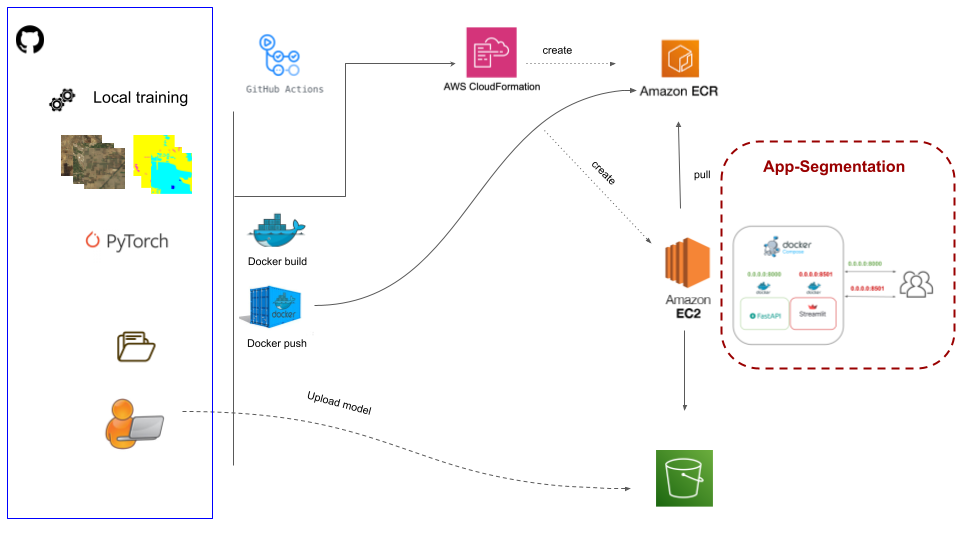

# Image Segmentation Deployment with FastAPI and Streamlit

This project deploys an image segmentation application where users can upload images, and the application returns segmentation maps using the DeepLabV3 model 
trained on the [Deepglobe dataset](https://paperswithcode.com/dataset/deepglobe). 
The backend is implemented with FastAPI, and the frontend is created using Streamlit.


## Table of Contents

- [Introduction](#introduction)
- [Project Structure](#project-structure)
- [Dependencies](#dependencies)
- [Getting Started](#getting-started)
  - [Clone the Repository](#clone-the-repository)
  - [Setting up Environment Variables](#setting-up-environment-variables)
  - [Building Docker Images](#building-docker-images)
  - [Running Docker Containers](#running-docker-containers)
- [Usage](#usage)
  - [Accessing the Application](#accessing-the-application)
  - [Uploading Images](#uploading-images)
  - [Getting Segmentation Maps](#getting-segmentation-maps)
- [Troubleshooting](#troubleshooting)
- [Contributing](#contributing)
- [License](#license)

## Introduction

This project deploys an image segmentation application where users can upload images, and the application returns segmentation maps using DL models. The backend is implemented with FastAPI, and the frontend is created using Streamlit.
FastAPI is used for handling API requests, while Streamlit offers an intuitive user interface for data visualization and interaction. The application is deployed on Amazon EC2 instances, ensuring scalability and reliability.
Docker containers are used to package the FastAPI and Streamlit applications. 

## Project Architecture



## Deployment steps

As illustrated in the scheme above the deployment steps are:

1. Containerization: Dockerize the FastAPI and Streamlit applications, creating Docker images. Docker-compose is then created.
2. ECR Image Registry: Push the Docker images to Amazon ECR.
3. EC2 Instance: Provision an EC2 instance on AWS, ensuring it has the necessary permissions to pull Docker images from ECR. This is configured via Cloudformation (see AWS_templates).
4. Container Deployment: Pull Docker images from ECR and deploy containers on the EC2 instance.

## Project Structure

- **`AWS_templates/`**: Contains the cloudformation template for the model deployment in AWS, including bucket creation and services configuration (EC2 and ECR).
- **`deploy-fastapi/`**: Contains the code for the Streamlit frontend for user interaction and the FastAPI backend to process the requests. 
- **`deploy-lambda/`**: Conatins the relevant code for the deployment via lambda functions ***in progress...***
- **`notebooks/`**: Notebooks examples for the model training and inference.
- **`Dockerfile`**: Dockerfile for building the Docker images.
- **`src`**: Code for the data process, model training and inferences.
- **`README.md`**: Documentation for setting up and running the deployment.

## Dependencies

- Python 3.11
- Docker
- Docker Compose
- see requirements.txt

## Usage

### Accessing the Application

- FastAPI Swagger Documentation: [http://localhost:8000/docs](http://localhost:8000/docs)
- Streamlit Application: [http://localhost:8501](http://localhost:8501)

### Uploading Images

Visit the Streamlit application URL and use the file uploader to upload images for segmentation. To obtain the images, visit the data availability in the paper.

### Getting Segmentation Maps

- Click the "Get segmentation map" button in the Streamlit application after uploading an image.

## Troubleshooting

If you encounter any issues during the deployment or usage, here are some common troubleshooting steps:

### FastAPI Logs

Inspect the logs of the FastAPI container for any error messages or issues:

```bash
docker logs <fastapi_container_name_or_id>


### Clone the Repository

```bash
git clone https://github.com/your-username/image-segmentation-deployment.git
cd image-segmentation-deployment
```


#### Caution note:** This is an ongoing project, and as such, it may not be working (yet) properly. It will be updated soon.
